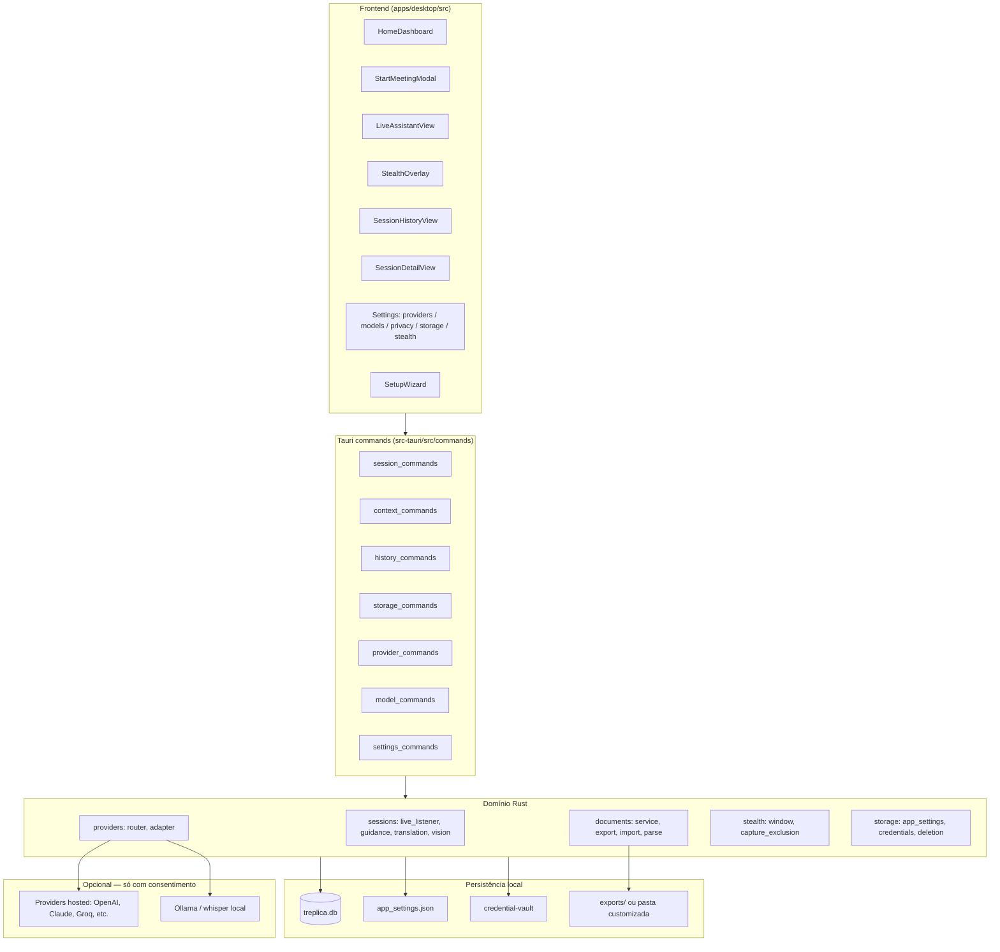
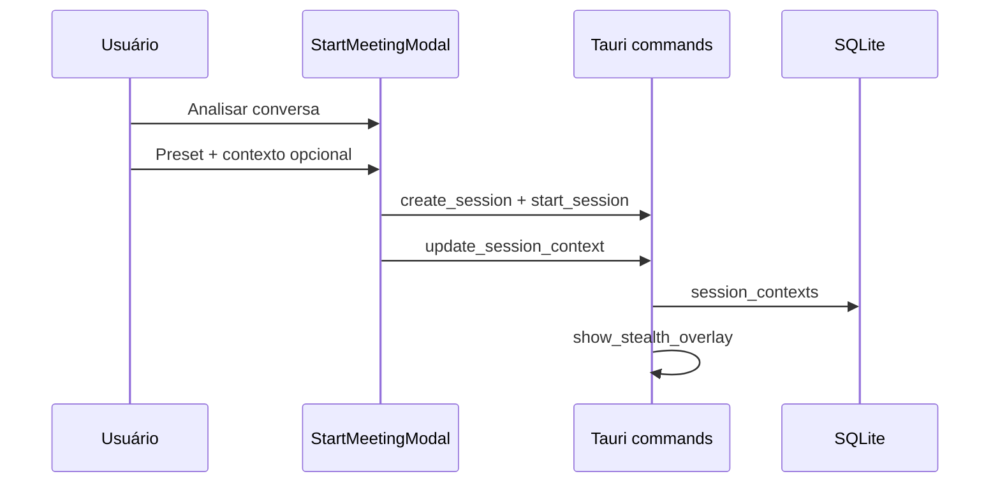

# Ecossistema Treplica — Visão geral

**Status**: Documentação viva (atualizada com o estado do produto em maio/2026)  
**Spec principal**: [spec.md](./spec.md)  
**Modelo de dados**: [data-model.md](./data-model.md)  
**Plano técnico**: [plan.md](./plan.md)

Este documento descreve como o Treplica funciona de ponta a ponta: superfícies de UI, backend Rust, persistência, fluxos de usuário e contratos entre módulos. Use-o como mapa antes de ler contratos específicos em `contracts/`.

---

## 1. O que é o Treplica

Aplicação desktop **local-first** (Windows/macOS) para:

- Transcrever e traduzir conversas ao vivo
- Gerar orientações contextuais (respostas, objeções, follow-ups)
- Analisar capturas de tela (visão)
- Guardar histórico, documentos gerados e auditoria **no dispositivo do usuário**

Stack: **Tauri 2** + **Rust** (core, SQLite, providers) + **React/TypeScript** (UI) + **SQLite** (`treplica.db`).

Não há conta obrigatória, sync em nuvem nem limites artificiais de sessão.

---

## 2. Arquitetura em camadas



### Crates Rust (workspace)

| Crate / pacote | Responsabilidade |
|----------------|------------------|
| `apps/desktop/src-tauri` | App Tauri: comandos, wiring, áudio, stealth |
| `crates/local-store` | SQLite, repositórios, histórico |
| `crates/provider-core` | Adaptadores de IA, prompts, contratos de guidance/tradução/documentos |
| `crates/audio-core` | Abstrações de captura/transcrição simulada |

---

## 3. Superfícies da aplicação

### 3.1 Janela principal (`main`)

| Rota / view | Componente | Função |
|-------------|------------|--------|
| `home` | `HomeDashboard` | Hub: assistente atual, sessões recentes, atalhos para iniciar |
| `live` | `LiveAssistantView` | Sessão ao vivo: transcrição, tradução, orientações, configuração |
| `history` | `SessionHistoryView` | Lista com busca, filtro por status e **tipo de assistente** |
| `detail` | `SessionDetailView` | Detalhe com abas (ver §3.4) |
| `settings-*` | Várias views | Providers, modelos, privacidade, arquivos, stealth |

**TopBar**: navegação home / histórico / configurações, busca.

### 3.2 Modal “Iniciar reunião” (`StartMeetingModal`)

Disparado por **Analisar conversa** no dashboard (não pelos outros atalhos rápidos).

Permite antes de criar a sessão:

1. **Escolher preset de assistente** (`note-taker`, `sales`, `interview`, `general`) — ver [contracts/assistant-presets.md](./contracts/assistant-presets.md)
2. **Contexto pré-reunião** (opcional): texto, `.md`, `.txt` ou `.pdf` importado — ver [contracts/session-context.md](./contracts/session-context.md)

Ao confirmar: `create_session` → `start_session` → `update_session_context` → abre overlay stealth (ou view `live` se falhar).

### 3.3 Overlay stealth (`stealth`)

Janela separada, sempre no topo, com exclusão de captura de tela quando o SO suporta.

- Espelha capacidades da sessão ao vivo (transcrição, orientação, tradução)
- Atalho global de orientação: `Ctrl+Shift+O` (configurável em `app_settings`)
- Atalho stealth: `Ctrl+Shift+H` (padrão)
- Ao fechar/ocultar com sessão ativa: mesmo fluxo de confirmação que a janela principal (§3.5)

### 3.4 Detalhe da sessão — abas

| Aba | Conteúdo |
|-----|----------|
| Conversa | Transcrição + traduções em formato chat |
| **Contexto** | Preset, configuração da sessão, **contexto pré-reunião** importado |
| Orientações | Sugestões geradas com rationale |
| Traduções | Lista de segmentos traduzidos |
| Auditoria | Eventos + chamadas a providers |
| Documentos | Gerar/exportar/copiar/excluir artefatos |

### 3.5 Ciclo de vida da sessão e confirmação de saída

Estados: `draft` → `listening` ↔ `paused` → `ended` (ou `failed` / `deleted`).

**Confirmação ao sair** (`EndSessionConfirmModal` + `useSessionLeavePrompt`):

- Navegação para outra view com sessão ativa
- Fechar janela principal
- Ocultar overlay stealth

Opções: **Encerrar sessão**, **Manter ativa em segundo plano**, **Cancelar**.

Comando Rust: `active_session_requires_leave_prompt`.

### 3.6 Configurações

| Seção | View | Persistência |
|-------|------|--------------|
| Provedores de IA | `ProviderSettingsView` | SQLite `provider_configs` + keyring |
| Modelos por função | `ModelRoutingSettingsView` | `app_settings.model_routing` |
| Privacidade | `PrivacySettingsView` | SQLite `user_profiles.privacy_mode` + `hosted_warning_acknowledged` em JSON |
| **Arquivos e backup** | `DataStorageSettingsView` | `app_settings.documents_export_dir` + import |
| Modo discreto | `StealthSettingsView` | `app_settings.stealth_hotkey` + estado runtime |

Ver [contracts/app-settings.md](./contracts/app-settings.md).

### 3.7 Onboarding (`SetupWizard`)

Exibido na primeira execução até `onboarding_completed` em `app_settings.json`:

- Permissões de microfone e tela
- Idioma de transcrição
- Teste de provider de IA
- Atalho de envio de transcrição

---

## 4. Fluxos principais

### 4.1 Iniciar sessão com contexto



### 4.2 Captura de áudio (sistema + microfone)

Durante `listening`, o app mantém **duas entradas em paralelo**:

| Entrada | Implementação | Plataformas |
|---------|---------------|-------------|
| **Sistema** | `native_system_capture` (Rust, `cpal` loopback + VAD + `SystemSttService`) | Windows (WASAPI), macOS 14.6+ (Core Audio tap) |
| **Microfone** | WebView: `useCloudAudioStt` → `ingest_system_audio_chunk` | Todas (com STT na nuvem) |

- **Auto-start**: áudio do sistema e microfone iniciam ao entrar em escuta (quando STT na nuvem está disponível).
- **Mute**: apenas o microfone (`MediaStreamTrack.enabled` + VAD desligado); o sistema continua.
- **Fallback sistema**: `getDisplayMedia` + compartilhar tela (Linux, macOS antigo, ou se loopback falhar).
- **Claims**: `AudioCaptureState` com slots `microphone` e `system` independentes (`claim_audio_capture` / `release_audio_capture`).
- **Comandos**: `start_native_system_audio`, `stop_native_system_audio`, `native_system_audio_supported`.
- **Eventos UI**: `native-system-audio-status`, `live-transcript-tick`.

macOS: `Info.plist` (`NSSystemAudioCaptureUsageDescription`, `NSMicrophoneUsageDescription`) e `Entitlements.plist` (`audio-input`). Versão mínima do bundle: **14.6**.

Ver também: [docs/user-guide.md](../../docs/user-guide.md), [docs/privacy.md](../../docs/privacy.md).

### 4.3 Orientação em tempo real

1. Áudio ou transcrição simulada → `ingest_live_transcript` / pipeline ao vivo
2. `guidance.rs` carrega `SessionContext` + transcrição recente
3. `GuidanceClassifier` infere cenário (vendas, entrevista, etc.)
4. `provider-core` monta system + user prompt (inclui **contexto pré-reunião**)
5. Provider resolvido por `ModelTask::Guidance` em `model_routing`
6. Sugestão persistida + evento `AiActivity` para UI

### 4.4 Tradução

Por segmento de transcrição, provider em `ModelTask::Translation`, painel ao vivo e histórico.

### 4.5 Visão (análise de imagem)

- Captura de monitor (`xcap`) ou upload
- `VisionService` + `ModelTask::Vision`
- Contexto de sessão incluído no prompt de visão

### 4.6 Documentos gerados

1. `generate_session_document` → provider (summarization) → SQLite
2. `export_to_disk` → `.md` com front matter YAML em `exports_root`
3. `storage_path` atualizado no registro

Pasta de exportação: padrão `{app_data}/exports` ou customizada — ver [contracts/local-data.md](./contracts/local-data.md).

### 4.7 Importação de documentos

1. Usuário escolhe pasta em **Arquivos e backup**
2. `import_session_documents` varre `**/*.md` com front matter Treplica
3. Sessões ausentes são recriadas como “Sessão importada”
4. Duplicatas ignoradas por `storage_path`

**Limitação**: importa artefatos `.md`, não restaura transcrições/orientações do banco.

---

## 5. Persistência — onde cada coisa fica

| Dado | Local | Notas |
|------|--------|-------|
| Sessões, transcrições, orientações, documentos (conteúdo) | `treplica.db` | Migrations em `src-tauri/migrations/` |
| Contexto por sessão | `session_contexts` | Inclui preset, system prompt, contexto pré-reunião |
| Preferências globais de assistente | `app_settings.json` → `assistant` | Espelhadas na sessão ao salvar |
| Roteamento de modelos | `app_settings.json` → `model_routing` | Por tarefa: guidance, translation, vision, etc. |
| Pasta de exportação customizada | `app_settings.json` → `documents_export_dir` | |
| Credenciais de API | OS keyring + refs no SQLite | Nunca em logs |
| Arquivos `.md` exportados | `exports/` ou pasta do usuário | Proveniência no front matter |
| Modo de privacidade | `user_profiles` | Perfil local único |

Migrations aplicadas incrementalmente (`0001` … `0003_pre_meeting_context`).

---

## 6. Mapa do código-fonte

### Frontend (`apps/desktop/src/`)

```
app/App.tsx                 # Router de views, modais, guardedNavigate
features/
  home/                     # HomeDashboard, StartMeetingModal
  live-session/             # useLiveSession, captura de áudio, painéis
  stealth/                  # StealthOverlay, workspace ao vivo
  history/                  # Lista, detalhe, abas, filtros
  assistants/               # Presets, AssistantConfigModal, utils
  documents/                # DocumentsPanel
  providers/                # Provider settings + modal
  settings/                 # Privacy, stealth, models, DataStorage
  setup/                    # SetupWizard
hooks/                      # useSessionLeavePrompt, lifecycle listeners
lib/                        # tauriClient, types, platform, hotkey
```

### Backend (`apps/desktop/src-tauri/src/`)

```
commands/                   # IPC Tauri → UI
sessions/                   # guidance, translation, vision, live_pipeline
documents/                  # service, export, import, parse (PDF/md)
providers/                  # router, adapter
storage/                    # AppState, app_settings, credentials, deletion
stealth/                    # overlay window, capture exclusion
audio/                      # native loopback, system STT, transcription
logging/                    # audit, performance
```

---

## 7. Índice de contratos e documentação

### Especificação (`specs/001-treplica-product-spec/`)

| Documento | Conteúdo |
|-----------|----------|
| [spec.md](./spec.md) | User stories, FR, success criteria |
| [ecosystem.md](./ecosystem.md) | Este arquivo — mapa do sistema |
| [data-model.md](./data-model.md) | Entidades e campos |
| [plan.md](./plan.md) | Decisões de implementação |
| [research.md](./research.md) | Pesquisa arquitetural |
| [quickstart.md](./quickstart.md) | Validação manual E2E |
| [verification.md](./verification.md) | Sign-off e testes |
| [tasks.md](./tasks.md) | Tarefas de implementação (histórico) |

### Contratos (`contracts/`)

| Contrato | Tópico |
|----------|--------|
| [desktop-app.md](./contracts/desktop-app.md) | Superfícies obrigatórias da UI |
| [local-data.md](./contracts/local-data.md) | Storage, export, import, exclusão |
| [provider-adapter.md](./contracts/provider-adapter.md) | Interface de providers |
| [session-context.md](./contracts/session-context.md) | Contexto de sessão e pré-reunião |
| [assistant-presets.md](./contracts/assistant-presets.md) | Presets de assistente |
| [app-settings.md](./contracts/app-settings.md) | `app_settings.json` |

### Guias operacionais (`docs/`)

| Documento | Público |
|-----------|---------|
| [docs/README.md](../../docs/README.md) | Índice da documentação |
| [building-from-source.md](../../docs/building-from-source.md) | Build e dev |
| [provider-setup.md](../../docs/provider-setup.md) | Configurar IA |
| [privacy.md](../../docs/privacy.md) | Privacidade e paths no disco |
| [user-guide.md](../../docs/user-guide.md) | Fluxos do usuário final |

---

## 8. Evolução pós-MVP (implementado, documentado aqui)

Funcionalidades adicionadas após o escopo inicial da spec e agora cobertas por user stories **US5–US10** em `spec.md`:

| Área | Referência |
|------|------------|
| Modal iniciar reunião + presets | US5, `StartMeetingModal` |
| Contexto pré-reunião (PDF/md/txt) | US5, migration 0003 |
| Preferências de assistente persistentes | US5, `app_settings.assistant` |
| Confirmação ao sair da sessão | US6 |
| Histórico com filtro por assistente | US7 |
| Aba Contexto no detalhe | US7 |
| Pasta de exportação + import | US8 |
| Onboarding | US9 |
| Roteamento de modelo por tarefa | US9 |
| Visão / snapshot | US10 |
| Overlay stealth como workspace completo | US6, `contracts/desktop-app.md` |

---

## 9. O que ainda não está no escopo

- Backup/restore completo do `treplica.db` via UI
- Sync multi-dispositivo
- Contas de equipe / admin
- Formatos de export além de Markdown (PDF/DOCX planejados no modelo, não implementados)
- Linux como alvo de release oficial
